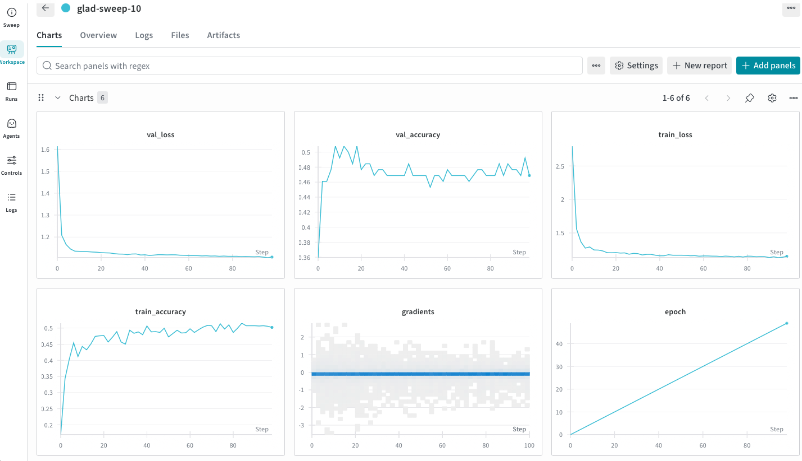
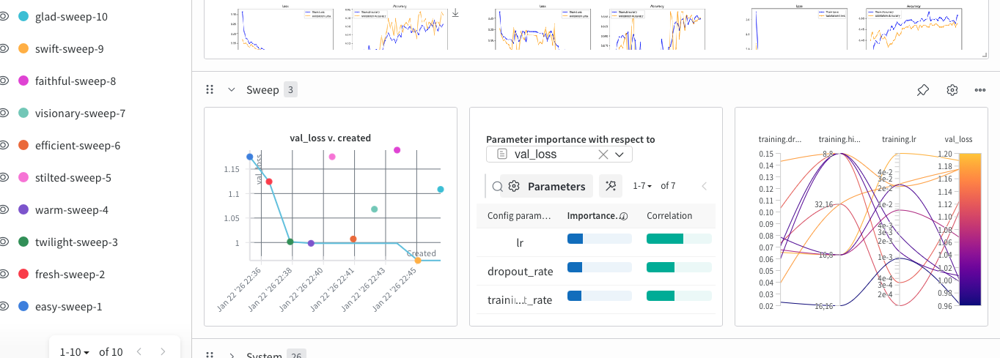
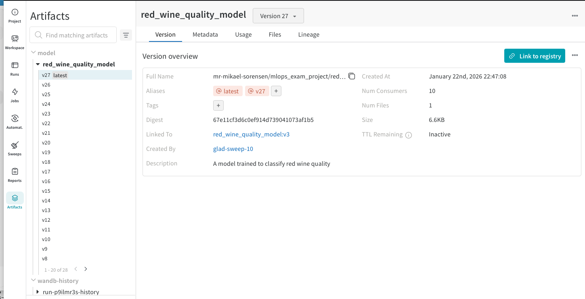
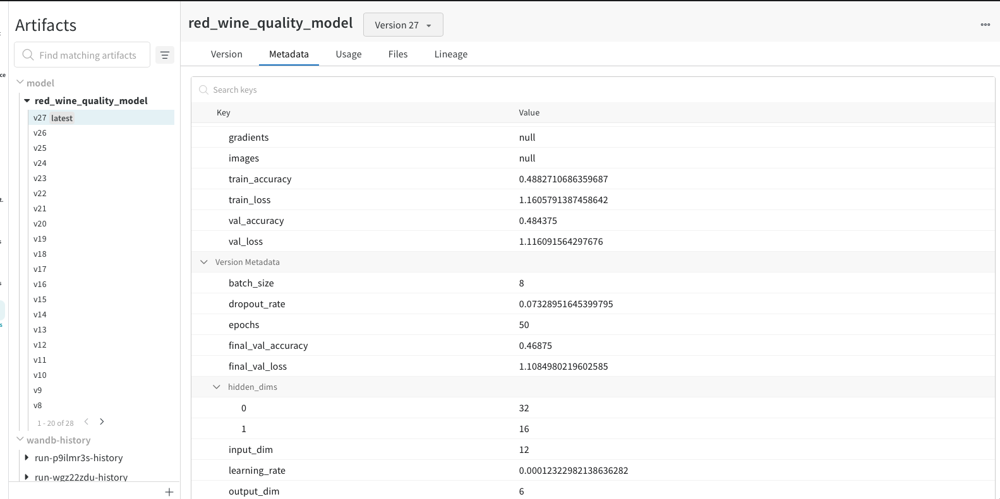
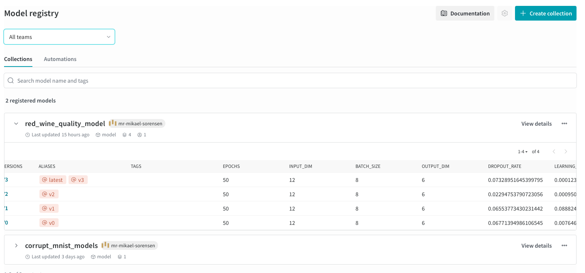
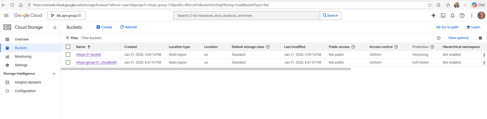
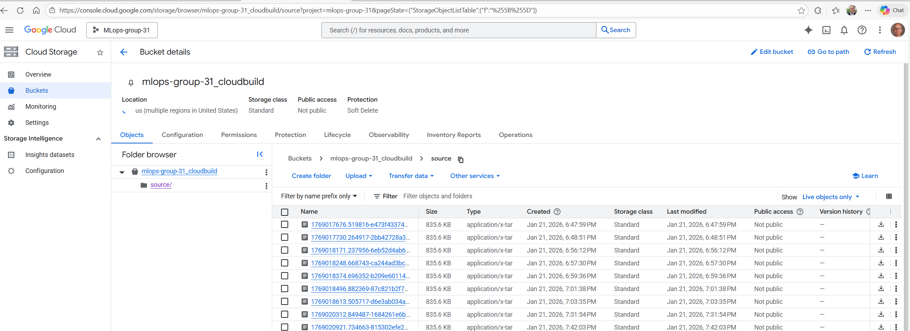
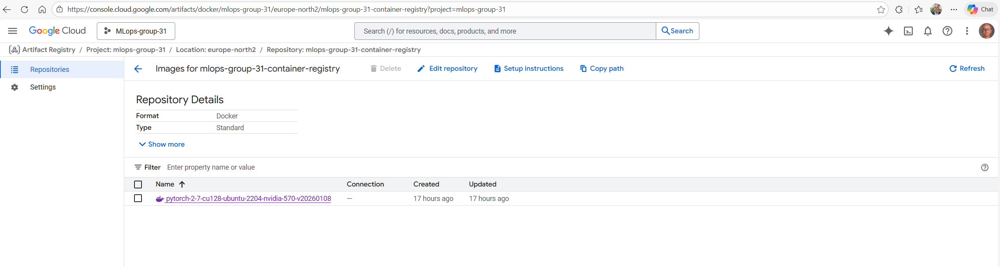
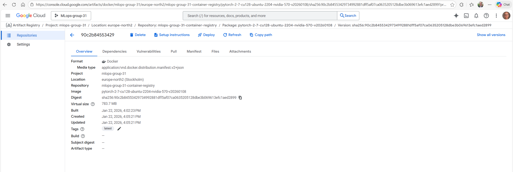
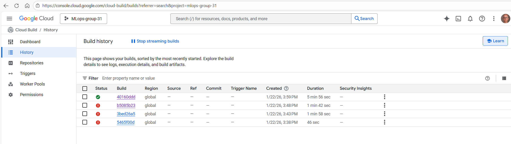

# Exam template for 02476 Machine Learning Operations


This is the report template for the exam. Please only remove the text formatted as with three dashes in front and behind
like:


```--- question 1 fill here ---```


Where you instead should add your answers. Any other changes may have unwanted consequences when your report is
auto-generated at the end of the course. For questions where you are asked to include images, start by adding the image
to the `figures` subfolder (please only use `.png`, `.jpg` or `.jpeg`) and then add the following code in your answer:


``


In addition to this markdown file, we also provide the `report.py` script that provides two utility functions:


Running:


```bash
python report.py html
```


Will generate a `.html` page of your report. After the deadline for answering this template, we will auto-scrape
everything in this `reports` folder and then use this utility to generate a `.html` page that will be your serve
as your final hand-in.


Running


```bash
python report.py check
```


Will check your answers in this template against the constraints listed for each question e.g. is your answer too
short, too long, or have you included an image when asked. For both functions to work you mustn't rename anything.
The script has two dependencies that can be installed with


```bash
pip install typer markdown
```


or


```bash
uv add typer markdown
```


## Overall project checklist


The checklist is *exhaustive* which means that it includes everything that you could do on the project included in the
curriculum in this course. Therefore, we do not expect at all that you have checked all boxes at the end of the project.
The parenthesis at the end indicates what module the bullet point is related to. Please be honest in your answers, we
will check the repositories and the code to verify your answers.


### Week 1


* [X] Create a git repository (M5)
* [X] Make sure that all team members have write access to the GitHub repository (M5)
* [X] Create a dedicated environment for you project to keep track of your packages (M2)
* [X] Create the initial file structure using cookiecutter with an appropriate template (M6)
* [X] Fill out the `data.py` file such that it downloads whatever data you need and preprocesses it (if necessary) (M6)
* [X] Add a model to `model.py` and a training procedure to `train.py` and get that running (M6)
* [X] Remember to either fill out the `requirements.txt`/`requirements_dev.txt` files or keeping your
    `pyproject.toml`/`uv.lock` up-to-date with whatever dependencies that you are using (M2+M6)
* [X] Remember to comply with good coding practices (`pep8`) while doing the project (M7)
* [X] Do a bit of code typing and remember to document essential parts of your code (M7)
* [-] Setup version control for your data or part of your data (M8)
* [X] Add command line interfaces and project commands to your code where it makes sense (M9)
* [X] Construct one or multiple docker files for your code (M10)
* [X] Build the docker files locally and make sure they work as intended (M10)
* [X] Write one or multiple configurations files for your experiments (M11)
* [X] Used Hydra to load the configurations and manage your hyperparameters (M11)
* [-] Use profiling to optimize your code (M12)
* [X] Use logging to log important events in your code (M14)
* [X] Use Weights & Biases to log training progress and other important metrics/artifacts in your code (M14)
* [X] Consider running a hyperparameter optimization sweep (M14)
* [-] Use PyTorch-lightning (if applicable) to reduce the amount of boilerplate in your code (M15)


### Week 2


* [X] Write unit tests related to the data part of your code (M16)
* [X] Write unit tests related to model construction and or model training (M16)
* [X] Calculate the code coverage (M16)
* [X] Get some continuous integration running on the GitHub repository (M17)
* [-] Add caching and multi-os/python/pytorch testing to your continuous integration (M17)
* [X] Add a linting step to your continuous integration (M17)
* [X] Add pre-commit hooks to your version control setup (M18)
* [-] Add a continues workflow that triggers when data changes (M19)
* [-] Add a continues workflow that triggers when changes to the model registry is made (M19)
* [-] Create a data storage in GCP Bucket for your data and link this with your data version control setup (M21)
* [ ] Create a trigger workflow for automatically building your docker images (M21)
* [-] Get your model training in GCP using either the Engine or Vertex AI (M21)
* [X] Create a FastAPI application that can do inference using your model (M22)
* [ ] Deploy your model in GCP using either Functions or Run as the backend (M23)
* [X] Write API tests for your application and setup continues integration for these (M24)
* [X] Load test your application (M24)
* [-] Create a more specialized ML-deployment API using either ONNX or BentoML, or both (M25)
* [-] Create a frontend for your API (M26)


### Week 3


* [-] Check how robust your model is towards data drifting (M27)
* [-] Setup collection of input-output data from your deployed application (M27)
* [-] Deploy to the cloud a drift detection API (M27)
* [-] Instrument your API with a couple of system metrics (M28)
* [ ] Setup cloud monitoring of your instrumented application (M28)
* [ ] Create one or more alert systems in GCP to alert you if your app is not behaving correctly (M28)
* [-] If applicable, optimize the performance of your data loading using distributed data loading (M29)
* [-] If applicable, optimize the performance of your training pipeline by using distributed training (M30)
* [ ] Play around with quantization, compilation and pruning for you trained models to increase inference speed (M31)


### Extra


* [ ] Write some documentation for your application (M32)
* [ ] Publish the documentation to GitHub Pages (M32)
* [ ] Revisit your initial project description. Did the project turn out as you wanted?
* [ ] Create an architectural diagram over your MLOps pipeline
* [ ] Make sure all group members have an understanding about all parts of the project
* [ ] Uploaded all your code to GitHub


## Group information


### Question 1
> **Enter the group number you signed up on <learn.inside.dtu.dk>**
>
> Answer:


031


### Question 2
> **Enter the study number for each member in the group**
>
> Example:
>
> *sXXXXXX, sXXXXXX, sXXXXXX*
>
> Answer:


s951108, s224202, s183737, s260014


### Question 3
> **Did you end up using any open-source frameworks/packages not covered in the course during your project? If so**
> **which did you use and how did they help you complete the project?**
>
> Recommended answer length: 0-200 words.
>
> Example:
> *We used the third-party framework ... in our project. We used functionality ... and functionality ... from the*
> *package to do ... and ... in our project*.
>
> Answer:


We did not use any major open-source frameworks beyond those covered in the course. All dependencies (PyTorch, FastAPI, Hydra, etc.) were frameworks taught in the course curriculum.


## Coding environment


> In the following section we are interested in learning more about you local development environment. This includes
> how you managed dependencies, the structure of your code and how you managed code quality.


### Question 4


> **Explain how you managed dependencies in your project? Explain the process a new team member would have to go**
> **through to get an exact copy of your environment.**
>
> Recommended answer length: 100-200 words
>
> Example:
> *We used ... for managing our dependencies. The list of dependencies was auto-generated using ... . To get a*
> *complete copy of our development environment, one would have to run the following commands*
>
> Answer:


We used the uv package manager to manage dependencies for the project. This meant that the list of dependencies was automatically generated as we used 'uv add' to add new dependencies to the project. In order to get a complete copy of our development environment, a user would first have to install uv, then clone our repository. With the working directory set as the top of the project, the user can simply run 'uv sync --all-groups' in order to download and install the full list of dependencies. If the user was not interested in certain packages relating to the development process, such as pre-commit and ruff, they could simply run 'uv sync' to get the packages necessary for running the code.


### Question 5


> **We expect that you initialized your project using the cookiecutter template. Explain the overall structure of your**
> **code. What did you fill out? Did you deviate from the template in some way?**
>
> Recommended answer length: 100-200 words
>
> Example:
> *From the cookiecutter template we have filled out the ... , ... and ... folder. We have removed the ... folder*
> *because we did not use any ... in our project. We have added an ... folder that contains ... for running our*
> *experiments.*
>
> Answer:


We have filled out the configs, data, dockerfiles, models, outputs, reports, src, tests.
Notebooks folder not used. No folders deleted.


### Question 6


> **Did you implement any rules for code quality and format? What about typing and documentation? Additionally,**
> **explain with your own words why these concepts matters in larger projects.**
>
> Recommended answer length: 100-200 words.
>
> Example:
> *We used ... for linting and ... for formatting. We also used ... for typing and ... for documentation. These*
> *concepts are important in larger projects because ... . For example, typing ...*
>
> Answer:


We have used Ruff for linting and formatting. Linting finds unused variables, inconsistencies, logical errors, syntax etc. Formatting takes
care of the consistent visual look of the code.
In larger projects with many developers, the ability to quickly read each others code is enhanced by consistent formatting. And linting errors are highly correlated
with actual bugs, although linting doesn't guarantee you reach your end goal.


## Version control


> In the following section we are interested in how version control was used in your project during development to
> corporate and increase the quality of your code.


### Question 7


> **How many tests did you implement and what are they testing in your code?**
>
> Recommended answer length: 50-100 words.
>
> Example:
> *In total we have implemented X tests. Primarily we are testing ... and ... as these the most critical parts of our*
> *application but also ... .*
>
> Answer:


In total we have implemented 25 tests. We are testing data loading, preprocessing, and split functionality in test_data.py (10 tests). We test model construction, forward pass, parameter counting, and state dict functionality in test_model.py (5 tests). We have integration tests covering the full pipeline from data loading through training in test_integration.py (7 tests). Finally, we have API smoke tests in test_api.py (3 tests) verifying the FastAPI endpoints work correctly.


### Question 8


> **What is the total code coverage (in percentage) of your code? If your code had a code coverage of 100% (or close**
> **to), would you still trust it to be error free? Explain you reasoning.**
>
> Recommended answer length: 100-200 words.
>
> Example:
> *The total code coverage of code is X%, which includes all our source code. We are far from 100% coverage of our **
> *code and even if we were then...*
>
> Answer:


The total code coverage of our code is 93%, which includes all our source code in the src/mlops_exam_project directory. We are not at 100% coverage - the uncovered lines are primarily the `if __name__ == "__main__"` guards in our modules, which we intentionally exclude as they are entry points rather than core logic. Even with 100% code coverage, we would not trust the code to be error-free. Code coverage measures which lines are executed during tests, but it doesn't guarantee that all edge cases are tested, that the assertions are correct, or that the tests themselves are well-designed. High coverage is a good indicator of test thoroughness, but bugs can still exist in the logic, error handling, or integration between components.


### Question 9


> **Did you workflow include using branches and pull requests? If yes, explain how. If not, explain how branches and**
> **pull request can help improve version control.**
>
> Recommended answer length: 100-200 words.
>
> Example:
> *We made use of both branches and PRs in our project. In our group, each member had an branch that they worked on in*
> *addition to the main branch. To merge code we ...*
>
> Answer:


We started by defining feature branches that could be delegated to the 4 of us. We used Github as the central repository with a main branch, not directly accessible.
Each member used Git, and used git push to upload their local branch to the remote branch. On Github, a pull request is then requested to pull the remote branch into
the main branch. We set it up so that someone else than the pull requester had to approve the merge into main. This way, two x two eyes are always on the code, and
the main branch is kept as well-working as possible.


### Question 10


> **Did you use DVC for managing data in your project? If yes, then how did it improve your project to have version**
> **control of your data. If no, explain a case where it would be beneficial to have version control of your data.**
>
> Recommended answer length: 100-200 words.
>
> Example:
> *We did make use of DVC in the following way: ... . In the end it helped us in ... for controlling ... part of our*
> *pipeline*
>
> Answer:


We did not use DVC for managing data in this project. However, DVC would have been beneficial for version controlling our wine quality dataset, especially if we had multiple versions of preprocessed data or if team members were experimenting with different data cleaning approaches. DVC would allow us to track changes to the dataset over time, share large data files efficiently through cloud storage (without committing them to Git), and ensure reproducibility by linking specific data versions to specific model training runs. This would be particularly useful if we were continuously updating our dataset with new wine samples or experimenting with different feature engineering strategies.


### Question 11


> **Discuss you continuous integration setup. What kind of continuous integration are you running (unittesting,**
> **linting, etc.)? Do you test multiple operating systems, Python  version etc. Do you make use of caching? Feel free**
> **to insert a link to one of your GitHub actions workflow.**
>
> Recommended answer length: 200-300 words.
>
> Example:
> *We have organized our continuous integration into 3 separate files: one for doing ..., one for running ... testing*
> *and one for running ... . In particular for our ..., we used ... .An example of a triggered workflow can be seen*
> *here: <weblink>*
>
> Answer:


We set up Github actions for 1) Ruff linting, 2) Pre-commits and 3) unit-tests. All was done as triggered workflow on pushes and pull requests by 3 yaml files.


## Running code and tracking experiments


> In the following section we are interested in learning more about the experimental setup for running your code and
> especially the reproducibility of your experiments.


### Question 12


> **How did you configure experiments? Did you make use of config files? Explain with coding examples of how you would**
> **run a experiment.**
>
> Recommended answer length: 50-100 words.
>
> Example:
> *We used a simple argparser, that worked in the following way: Python  my_script.py --lr 1e-3 --batch_size 25*
>
> Answer:


We used Hydra for configuration management with YAML config files stored in the configs/ directory. The main config file (config.yaml) includes data paths, model paths, and file names, while separate configs exist for model architecture (model/default.yaml) and training parameters (training/default.yaml). To run an experiment with default settings: `uv run python src/mlops_exam_project/train.py`. To override specific parameters: `uv run python src/mlops_exam_project/train.py training.learning_rate=0.001 training.batch_size=64`. Hydra automatically creates timestamped output directories for each run, making it easy to track different experiments.


### Question 13


> **Reproducibility of experiments are important. Related to the last question, how did you secure that no information**
> **is lost when running experiments and that your experiments are reproducible?**
>
> Recommended answer length: 100-200 words.
>
> Example:
> *We made use of config files. Whenever an experiment is run the following happens: ... . To reproduce an experiment*
> *one would have to do ...*
>
> Answer:


We used Hydra configuration files to ensure reproducibility. Whenever an experiment is run, Hydra automatically saves the complete configuration (including all overrides) to a .hydra subdirectory in the output folder with a timestamp. This preserves all hyperparameters, data paths, and model settings used for that specific run. We also use logging (loguru) to record training progress, data paths, and model checkpoints. To reproduce an experiment, one would navigate to the specific output folder, inspect the saved config.yaml file in the .hydra directory, and re-run the training script with those exact parameters. The combination of version-controlled code (via Git), saved configurations (via Hydra), and comprehensive logging ensures that experiments can be replicated exactly.


We also logged our experiments, including models and hyperparameters,  using W&B, as briefly discussed in the answer to the next question.


### Question 14


> **Upload 1 to 3 screenshots that show the experiments that you have done in W&B (or another experiment tracking**
> **service of your choice). This may include loss graphs, logged images, hyperparameter sweeps etc. You can take**
> **inspiration from [this figure](figures/wandb.png). Explain what metrics you are tracking and why they are**
> **important.**
>
> Recommended answer length: 200-300 words + 1 to 3 screenshots.
>
> Example:
> *As seen in the first image when have tracked ... and ... which both inform us about ... in our experiments.*
> *As seen in the second image we are also tracking ... and ...*
>
> Answer:


As seen in the image , we tracked both the training  and validation losses and accuracies for each experiment, which both inform us about the performance of the model (with a given set of hyperparameter, which in turn are logged as metadata in the artifacts registry).


For hyperparameter optimization we utilized the W&B sweeping agent. As seen in the image , we can from the parallel coordinate chart plot  assess  and compare the performance of the different   models with a given set of hyperparameters.


We also save the models to the artifacts registry . The metadata for each model, including the  hyperparameters, were also saved to the artifacts registry .  This is  important since the different models have different  hyperparameters (e.g., the number of hidden layers and the depth of the hidden layer, as indicated by  hidden_dims).


Finally, we mention that the models were saved in the model registry  .


 The  W&B files  are located in the src/mlops_exam_wandb directory of our repository.


### Question 15


> **Docker is an important tool for creating containerized applications. Explain how you used docker in your**
> **experiments/project? Include how you would run your docker images and include a link to one of your docker files.**
>
> Recommended answer length: 100-200 words.
>
> Example:
> *For our project we developed several images: one for training, inference and deployment. For example to run the*
> *training docker image: `docker run trainer:latest lr=1e-3 batch_size=64`. Link to docker file: <weblink>*
>
> Answer:


For our project we developed multiple Docker images for different purposes. We have training dockerfiles (train_hydra.dockerfile, train_hydra_config_mounting.dockerfile, train.dockerfile) and evaluation dockerfiles (evaluate_hydra.dockerfile, evaluate.dockerfile). The Hydra versions integrate with our configuration system, while the config mounting variant allows external config files to be mounted at runtime. (It is important to note that train.dockerfile and evaluate.dockerfile are compatible with the files src/mlops_exam_project since Hydra is used, and hence we use the Hydra compatible docker files train_hydra.dockerfile, train_hydra_config_mounting.dockerfile and evaluate_hydra.dockerfile.)


To build a training image: `docker build -f dockerfiles/train_hydra.dockerfile -t train:latest .`. To run it: `docker run train:latest`. The dockerfiles are located in the dockerfiles/ directory of our repository. Link to example dockerfile: https://github.com/s224202/MLOps_exam_project/blob/main/dockerfiles/train_hydra.dockerfile


### Question 16


> **When running into bugs while trying to run your experiments, how did you perform debugging? Additionally, did you**
> **try to profile your code or do you think it is already perfect?**
>
> Recommended answer length: 100-200 words.
>
> Example:
> *Debugging method was dependent on group member. Some just used ... and others used ... . We did a single profiling*
> *run of our main code at some point that showed ...*
>
> Answer:


Debugging methods varied among group members. Most team members used print statements and logging (loguru) to trace execution flow and inspect variable values during development. We also used VS Code's built-in debugger with breakpoints for more complex issues. The comprehensive logging we implemented in train.py helped us track down issues with data paths and Hydra's working directory changes. For testing, pytest's verbose output (`-v` flag) and traceback information helped identify failing test cases. We did not perform formal profiling of our code. Given more time, profiling would be valuable to identify bottlenecks in data preprocessing or training loops, but for our relatively small dataset and simple model architecture, performance was not a critical concern.


## Working in the cloud


> In the following section we would like to know more about your experience when developing in the cloud.


### Question 17


> **List all the GCP services that you made use of in your project and shortly explain what each service does?**
>
> Recommended answer length: 50-200 words.
>
> Example:
> *We used the following two services: Engine and Bucket. Engine is used for... and Bucket is used for...*
>
> Answer:


We used GCloud Compute, Bucket, Secrets Manager, Service Agent, Cloud Build and Container Registry.

Bucket were used for storage of Docker files and images, Service Agent was used as non-human app identifier, Cloud Build was used to generate Docker containers. We did not get to use Compute as such since we didn’t train the model in the cloud.


### Question 18


> **The backbone of GCP is the Compute engine. Explained how you made use of this service and what type of VMs**
> **you used?**
>
> Recommended answer length: 100-200 words.
>
> Example:
> *We used the compute engine to run our ... . We used instances with the following hardware: ... and we started the*
> *using a custom container: ...*
>
> Answer:


Of course some compute power was used to build Docker files etc, but we didn’t really get to use Compute, since we didn’t get to train the model in the cloud.


### Question 19


> **Insert 1-2 images of your GCP bucket, such that we can see what data you have stored in it.**
> **You can take inspiration from [this figure](figures/bucket.png).**
>
> Answer:






### Question 20


> **Upload 1-2 images of your GCP artifact registry, such that we can see the different docker images that you have**
> **stored. You can take inspiration from [this figure](figures/registry.png).**
>
> Answer:






### Question 21


> **Upload 1-2 images of your GCP cloud build history, so we can see the history of the images that have been build in**
> **your project. You can take inspiration from [this figure](figures/build.png).**
>
> Answer:





### Question 22


> **Did you manage to train your model in the cloud using either the Engine or Vertex AI? If yes, explain how you did**
> **it. If not, describe why.**
>
> Recommended answer length: 100-200 words.
>
> Example:
> *We managed to train our model in the cloud using the Engine. We did this by ... . The reason we choose the Engine*
> *was because ...*
>
> Answer:


No we did not.


## Deployment


### Question 23


> **Did you manage to write an API for your model? If yes, explain how you did it and if you did anything special. If**
> **not, explain how you would do it.**
>
> Recommended answer length: 100-200 words.
>
> Example:
> *We did manage to write an API for our model. We used FastAPI to do this. We did this by ... . We also added ...*
> *to the API to make it more ...*
>
> Answer:


We did manage to write an API for our model using FastAPI. The API is implemented in src/mlops_exam_project/api.py and includes a root endpoint (GET /) that returns a status message, and a predict endpoint (POST /predict) that accepts wine feature data and returns a quality prediction. The API handles model loading gracefully with try-except blocks to provide fallback dummy predictions if the model fails to load. We implemented proper HTTP status codes and JSON response formatting. The API uses uvicorn as the ASGI server for serving the FastAPI application. The implementation is simple but functional, providing a RESTful interface for model inference.


### Question 24


> **Did you manage to deploy your API, either in locally or cloud? If not, describe why. If yes, describe how and**
> **preferably how you invoke your deployed service?**
>
> Recommended answer length: 100-200 words.
>
> Example:
> *For deployment we wrapped our model into application using ... . We first tried locally serving the model, which*
> *worked. Afterwards we deployed it in the cloud, using ... . To invoke the service an user would call*
> *`curl -X POST -F "file=@file.json"<weburl>`*
>
> Answer:


--- We only deployed the api locally, using localhost. To invoke the API the user can send a post request with a JSON file containing a sample that they wish to get an estimated quality for.---


### Question 25


> **Did you perform any unit testing and load testing of your API? If yes, explain how you did it and what results for**
> **the load testing did you get. If not, explain how you would do it.**
>
> Recommended answer length: 100-200 words.
>
> Example:
> *For unit testing we used ... and for load testing we used ... . The results of the load testing showed that ...*
> *before the service crashed.*
>
> Answer:


We implemented unit tests for our API using pytest in test_api.py. These tests verify that the API endpoints respond correctly and that the training workflow can be invoked. However, we did not perform load testing of the API. If we were to implement load testing, we would use a tool like Locust or Apache JMeter to simulate multiple concurrent users sending requests to the /predict endpoint. This would help us understand the API's throughput (requests per second), response time under load, and identify the breaking point where the service becomes unresponsive. Load testing would be especially important before deploying to production to ensure the API can handle expected traffic volumes.


### Question 26


> **Did you manage to implement monitoring of your deployed model? If yes, explain how it works. If not, explain how**
> **monitoring would help the longevity of your application.**
>
> Recommended answer length: 100-200 words.
>
> Example:
> *We did not manage to implement monitoring. We would like to have monitoring implemented such that over time we could*
> *measure ... and ... that would inform us about this ... behaviour of our application.*
>
> Answer:


We did not manage to implement monitoring for our deployed model. If we had implemented monitoring, it would help ensure the longevity of the application by tracking key metrics over time. We would want to monitor system metrics like CPU usage, memory consumption, request latency, and error rates to detect performance degradation or service outages. For the ML model specifically, we would track prediction distributions to detect data drift (when input data characteristics change over time) and model performance metrics if we had ground truth labels for incoming requests. Monitoring would alert us to issues like model degradation, unusual prediction patterns, or infrastructure problems before they impact users significantly.


## Overall discussion of project


> In the following section we would like you to think about the general structure of your project.


### Question 27


> **How many credits did you end up using during the project and what service was most expensive? In general what do**
> **you think about working in the cloud?**
>
> Recommended answer length: 100-200 words.
>
> Example:
> *Group member 1 used ..., Group member 2 used ..., in total ... credits was spend during development. The service*
> *costing the most was ... due to ... . Working in the cloud was ...*
>
> Answer:


Group member Peter spent $2.
Group member Adam spent $2.12
Group member Mikael spent $2.


Our ML model was very modest and building Docker container was cheap.


### Question 28


> **Did you implement anything extra in your project that is not covered by other questions? Maybe you implemented**
> **a frontend for your API, use extra version control features, a drift detection service, a kubernetes cluster etc.**
> **If yes, explain what you did and why.**
>
> Recommended answer length: 0-200 words.
>
> Example:
> *We implemented a frontend for our API. We did this because we wanted to show the user ... . The frontend was*
> *implemented using ...*
>
> Answer:


--- question 28 fill here ---


### Question 29


> **Include a figure that describes the overall architecture of your system and what services that you make use of.**
> **You can take inspiration from [this figure](figures/overview.png). Additionally, in your own words, explain the**
> **overall steps in figure.**
>
> Recommended answer length: 200-400 words
>
> Example:
>
> *The starting point of the diagram is our local setup, where we integrated ... and ... and ... into our code.*
> *Whenever we commit code and push to GitHub, it auto triggers ... and ... . From there the diagram shows ...*
>
> Answer:


We each used our own PC (Windows, PC, Mac) and pushed to Github, so that this part was Git controlled. We then built Docker images based on local repo into the GCloud.


### Question 30


> **Discuss the overall struggles of the project. Where did you spend most time and what did you do to overcome these**
> **challenges?**
>
> Recommended answer length: 200-400 words.
>
> Example:
> *The biggest challenges in the project was using ... tool to do ... . The reason for this was ...*
>
> Answer:


There are many systems involved, some commercial, some open source. Error messages are not always clear, especially Docker syntax and error messages are challenging. Our model was intentionally modest and did not pose any ML-trouble to us. The Git - Github framework is very powerful, but the nature of several people working together on building a system is complex.


### Question 31


> **State the individual contributions of each team member. This is required information from DTU, because we need to**
> **make sure all members contributed actively to the project. Additionally, state if/how you have used generative AI**
> **tools in your project.**
>
> Recommended answer length: 50-300 words.
>
> Example:
> *Student sXXXXXX was in charge of developing of setting up the initial cookie cutter project and developing of the*
> *docker containers for training our applications.*
> *Student sXXXXXX was in charge of training our models in the cloud and deploying them afterwards.*
> *All members contributed to code by...*
> *We have used ChatGPT to help debug our code. Additionally, we used GitHub Copilot to help write some of our code.*
> Answer:


s951108 has made the initial train.py and model.py on the basis of Pytorch, setup GCloud entities for Cloud Build, made architecture drawings, some bux fixing and pull request reviews.


s224202 has setup GitHub repo, made api.py, unit-tests, initial code for data processing, some work on docker in cloud, and worked on github actions


s183737 has made unittest, code coverage calculations, initial config setup, preliminary test_**.py files, minor work on train and model early, minor work on docker early.


s260014 has refined train.py,  model.py and data.py, setup local Docker creation,  created evaluate.py, visualize.py,  setup and created W&B files, experiment tracking, added some command line interface based on either typer or Hydra,  refined and added Hydra config files, and created markdown files for documentation and instructions for  Pytorch, Docker and W&B files.


We have used ChatGPT to help debug our code. Additionally, we used GitHub Copilot to help write some of our code.
